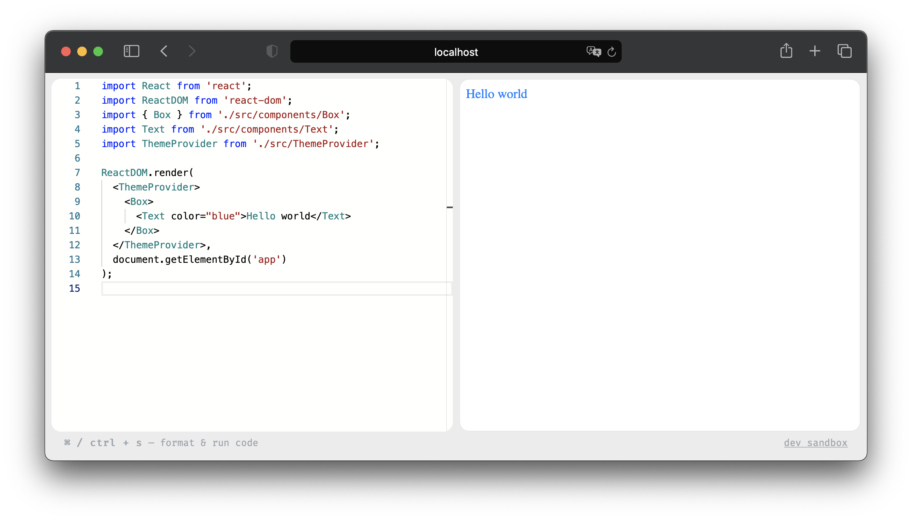

[](http://www.wtfpl.net/about/)
[](http://www.typescriptlang.org/)
[](https://github.com/prettier/prettier)
[](https://www.npmjs.com/package/dev-sandbox)
[](https://david-dm.org/iam-medvedev/dev-sandbox)
[](https://david-dm.org/iam-medvedev/dev-sandbox)
[](https://github.com/semantic-release/semantic-release)

<h1 align="center">
  dev-sandbox <sup>[beta]</sup>
</h1>

<div align="center">
  Play with your local code live in browser
</div>



## Features

- Deploys sandbox from root of your package.
- [Typescript](https://www.typescriptlang.org/) ready. Recognizes the types of local files and installed packages.
- Builds the code using [esbuild](https://esbuild.github.io) and sends the result directly to the browser.
- Syntax highlighting and code validation using [monaco](https://microsoft.github.io/monaco-editor/).

## Install

You can install `dev-sandbox` globally and use it from any local package.

```sh
$ yarn global add dev-sandbox
```

or

```sh
$ npm i -g dev-sandbox
```

## Usage

```
$ cd ./my-package
$ dev-sandbox

> Start listening on http://localhost:3000
```

## License

`dev-sandbox` is [MIT licensed](./LICENSE).
